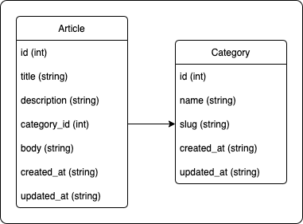

# Laravel Swagger Sample with Library
Swagger Library -> [L5 Swagger](https://github.com/DarkaOnLine/L5-Swagger)

ちなみに[L5 Swagger](https://github.com/DarkaOnLine/L5-Swagger)は[Swagger-PHP](https://github.com/zircote/swagger-php)をLaravelに最適化したラッパーライブラリで、ルーティングを自動で組み込んでくれたり、生成を自動化してくれる。そのままの記法でかけるのでドキュメントは[こちら](https://zircote.github.io/swagger-php/)を参照するとよい。

## App Structure (ER)


## 環境構築
```bash
$ git clone [repository_url]
$ cd [cloned_repository_path]
$ composer install
$ touch database/database.sqlite
$ cp .env.example .env
$ php artisan key:generate
$ php artisan migrate
$ php artisan db:seed
$ php artisan serve
```

```bash
$ php artisan l5-swagger:generate
```
を実行するとドキュメントが生成される。

```env
L5_SWAGGER_GENERATE_ALWAYS=true
```
.envにこれを追加することでSwaggerUIロード毎(ページ更新時)にドキュメント更新がかかる。

## マインド・参考情報
ライブラリを使わない場合は```storage/api-docs/api-docs.json```を手書きすることになるので、素直にライブラリ使った方がいいと思う。

流れのイメージとしては
- Modelで各パラメータのバリデーションなりフォーマットなりのプロパティを定義しSchemaとして登録
- Controllerで各ルーティングをSchemaを紐づけて登録
- Swagger-PHPがControllerとSchemaを紐づけてドキュメント(JSON)を生成。
- SwaggerUI(Swagger-PHPに組み込まれている)がドキュメントをロードして表示。

VSCodeに"Swagger-PHP"なる拡張があり、それを入れるとシンタックスハイライトがつくのでちょっと書きやすい。コメントに書くのでインデント整理とかのフォーマッタが欲しいところ...。

## 備忘録
```
[Syntax Error] Expected Doctrine\Common\Annotations\DocLexer::T_CLOSE_PARENTHESIS, got 'readOnly' at position [~~~].
```
が出た時は基本アノテーションを書いてるModelファイルの行末コンマつけ忘れ。エラー箇所の特定が激ムズなので書留。

## 感想
思ったよりコード量少なくスッキリかけた（Schemaの存在を知らなかった）
これはL5-Swagger一択になる気がする。